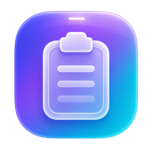

<p align="center">
  
</p>

<h1 align="center">Pasty</h1>

<p align="center">
  <strong>A blazing-fast, local-first, open-source clipboard manager for macOS — the upper-compatible successor to <a href="https://pasteapp.io/">Paste</a>, fully free under MIT.</strong>
</p>

<p align="center">
  <a href="https://ivygain.github.io/Pasty/">Website</a> ·
  <a href="https://github.com/IvyGain/Pasty/releases/latest">Download</a> ·
  <a href="docs/research/PASTE-RESEARCH.md">Design dossier</a>
</p>

**Status**: v0.2.0 — multi-select &amp; bulk paste landed on top of P0–P5.

  

## What makes Pasty different

| | Paste | Maccy | **Pasty** |
|---|---|---|---|
| Price | ¥4,500 / yr | Free OSS | **Free OSS (MIT)** |
| Spotlight-style center modal | ✗ | ✓ | ✓ |
| Bottom strip carousel | ✓ (40-50 % screen) | ✗ | ✓ (~25 % only) |
| **Notch-hover dropdown** | ✗ | ✗ | **✓ unique** |
| Pinboards with colors | ✓ | ✗ | ✓ |
| Paste Stack | ✓ | ✗ | ✓ |
| Snippet variables (`{{date}}`, `{{cursor}}`…) | ✗ | ✗ | ✓ |
| Code syntax highlight | ✗ | ✗ | ✓ |
| DSL search (`type:link source:Safari /regex/`) | ✗ | partial | ✓ |
| On-device OCR / tagging | ✓ (paid) | ✗ | ✓ free |
| Sync | iCloud only | ✗ | (P6, opt-in) |
| iOS sync | ✓ | ✗ | (P7) |

## Surfaces (the 3 ways to summon Pasty)

1. **`⇧⌘V`** — Spotlight-style center modal with DSL search, ⌘1-9 quick paste, ⇧↩ plain-text paste.
2. **`⌥⇧V`** — Paste-style bottom strip with carousel cards, kind filters, pinboard tabs.
3. **Hover the notch** — Liquid-Glass dropdown slides down from the top edge. Drag a card downward to drop it directly onto the editor. (Pasty's signature interaction; falls back to top-centre 20 % on non-notched Macs.)

Plus the menu-bar icon for quick access to recent clips, pause toggle, and settings.

## Requirements

- macOS 14.0 (Sonoma) or later
- Apple Silicon or Intel
- Accessibility permission (for `⌘V` auto-paste — Pasty prompts on first launch)

## Install

### Pre-built `.dmg` (recommended)

Download the latest [`Pasty.dmg`](https://github.com/IvyGain/Pasty/releases/latest/download/Pasty.dmg) (3.3 MB) and drag `Pasty.app` to `/Applications`. Pasty is ad-hoc signed; the first launch needs **right-click → Open** to bypass Gatekeeper.

### Multi-select &amp; bulk paste (new in v0.2)

- **Shift-click** a range, **⌘-click** to add/remove individual clips — same idiom as Finder.
- **Space** toggles the highlighted clip, **⇧↑/↓** extends the selection from the keyboard, **⌘A** selects every visible clip.
- **↩** pastes each selected clip in order with a tiny pause between, **⌥↩** pastes them joined into one block (newline-separated).
- Selection works identically in the Spotlight modal, the bottom strip, and the menu-bar list.

### Build from source

```bash
git clone https://github.com/IvyGain/Pasty.git
cd Pasty
make build           # debug build
make run             # build + launch
make package         # produces dist/Pasty.app + dist/Pasty-*.dmg
make release         # release-config .app + .dmg
make demo            # automated smoke test (copy → SQLite → FTS5)
```

`scripts/dev.sh` wraps Swift with the right `DEVELOPER_DIR` / `SDKROOT` so it builds even when `xcode-select` still points at the Command Line Tools.

## Data & privacy

Everything Pasty stores lives at:

```
~/Library/Application Support/Pasty/
├── pasty.sqlite       SQLite + FTS5 index of every clip
└── blobs/             binary blobs (images, files) — content-addressed
```

No cloud account. No telemetry. No analytics. Settings → Privacy lets you wipe the store with one click.

## Architecture

```
NSPasteboard (250 ms poll)
        │   change-count + SHA-256 dedupe + sensitive-flag filter
        ▼
PasteboardObserver  ──>  ClipItem (text / RTF / image / file / link / color)
        │
        ▼
ClipStore (GRDB / SQLite + FTS5)  ◀──  SearchEngine (DSL: type: source: pinboard: /regex/)
        │                                          │
        ▼                                          │
PinboardStore  ─── pin / unpin / order / colour ◀──┘
        │
        ▼
PanelCoordinator ─┬─> SpotlightPanel  (⇧⌘V)
                  ├─> StripPanel       (⌥⇧V)
                  └─> NotchHover       (mouse on notch)
                          │
                          ▼
                 PasteAutomator (CGEvent ⌘V into frontmost app)
                          │
                          ▼
                 SnippetEngine ({{date}} {{uuid}} {{cursor}} …)
                 SyntaxHighlighter (regex lexer per language)
                 DiffEngine (LCS line diff)
                 AIEngine (Vision OCR, NaturalLanguage tagging)
```

## Shortcuts

| Key | Action |
|---|---|
| `⇧⌘V` | Toggle Spotlight modal |
| `⌥⇧V` | Toggle bottom strip |
| `⌃⇧P` | Pause capture for 60 s |
| `↩`, `↑↓`, `⌘1-9` | Navigate / paste in panel |
| `⇧↩` | Paste as plain text |
| `Esc` | Dismiss panel |
| `␣` | Quick Look preview (in panel) |
| `⌘F` | Focus search field |
| `⌘E` | Edit clip |
| `⌘,` | Open Settings |

## Search DSL

```
pasty                       plain FTS5 keyword
type:link safari            kind filter + keyword
source:VSCode swift         source-app filter
pinboard:Code react         restrict to pinboard
/(TODO|FIXME)/              regex over preview + content
>1d                         only the last 24 h
type:image source:Slack >7d combine freely
```

## Roadmap

| Phase | Status | Highlights |
|---|---|---|
| P0 Foundation | ✅ shipped | `PasteboardObserver`, SQLite + FTS5, menu-bar UI |
| P1 Main flow | ✅ shipped | Global hotkey, Spotlight modal, CGEvent paste, DSL search |
| P2 Pinboards + Stack | ✅ shipped | Bottom strip, pinboard CRUD with colours, Paste Stack |
| P2.5 Notch-hover | ✅ shipped | Top-edge trigger + Liquid-Glass dropdown + drag&drop |
| P3 Developer features | ✅ shipped | Regex search, syntax highlight, snippet variables, diff view |
| P4 On-device AI | ✅ shipped | Vision OCR, NaturalLanguage tagging, heuristic summary |
| P5 Polish & distribute | ✅ shipped | Settings UI, JP/EN i18n, ad-hoc-signed `.dmg` build |
| P6 Sync (optional) | ⏳ next | Syncthing / WebDAV / iCloud — fully opt-in |
| P7 iOS / Vision Pro | ⏳ later | Universal Pasty Keyboard |
| P8 MCP server / CLI | ⏳ later | Claude / Cursor / Codex integration |

## Contributing

PRs welcome. See `docs/research/PASTE-RESEARCH.md` for the full design dossier (why every choice was made, what the competing apps do, what we are deliberately not building yet).

```bash
make build              # build
make test               # XCTest (needs Xcode license accepted)
```

To switch to URL-based dependencies (recommended once `sudo xcodebuild -license accept` is done):

1. Edit `Package.swift`, replace `.package(path: "Vendor/GRDB.swift")` with `.package(url: "https://github.com/groue/GRDB.swift.git", from: "6.29.0")`.
2. Delete `Vendor/`.
3. `make build`.

## License

MIT — see [LICENSE](LICENSE).

## Acknowledgements

- [Maccy](https://github.com/p0deje/Maccy) — proved Swift + polling is the right model.
- [Paste](https://pasteapp.io/) — set the bar in clipboard UX.
- [GRDB](https://github.com/groue/GRDB.swift) — the SQLite layer that makes FTS5 a joy.
